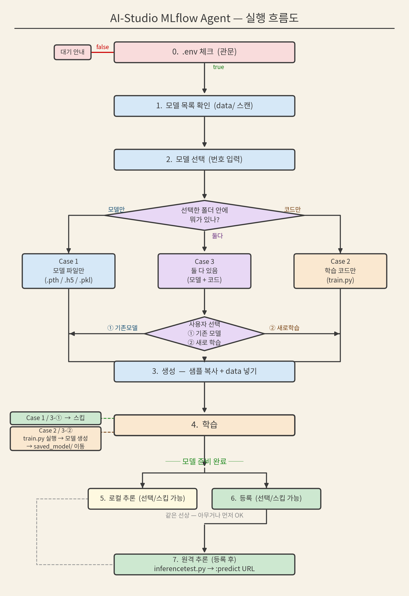
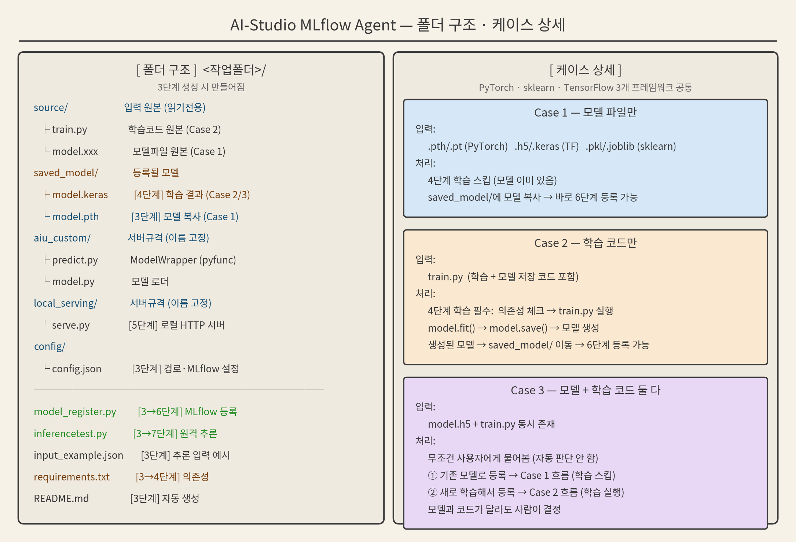

# AI-Studio MLflow Agent — 흐름 · 폴더구조 · 케이스

선택한 데이터를 기준으로 알맞은 샘플을 복사한 뒤, 데이터 정보로 템플릿 형식에 맞게 재작성하여 MLflow에 등록하는 에이전트다.





---

## 1. 실행 흐름 (7단계)

`.env` 체크(0단계)는 7단계보다 먼저 통과해야 하는 관문이다.

| 단계 | 이름 | 설명 | 실행 조건 |
|---|---|---|---|
| 0 | .env 체크 (관문) | MLflow 연결정보 확인. `ready:false`면 대기 안내 | 진입 시 자동 |
| 1 | 모델 목록 확인 | `data/` 스캔 + Case 판별 (모델만/학습만/둘다) | 진입 시 자동 |
| 2 | 모델 선택 | 번호 입력. Case 3(둘다)이면 기존모델/새학습 물어봄 | 사용자 선택 |
| 3 | 생성 | 데이터 kind에 맞는 샘플 복사 + data 정보로 재작성 | 사용자 선택 |
| 4 | 학습 | Case 2/3-학습선택: 의존성 체크 → `train.py` 실행 → 모델 생성 → `saved_model/` 이동. Case 1/3-기존모델: 스킵 | 사용자 선택 |
| 5 | 로컬 추론 | (선택/스킵 가능) 등록 전 로컬에서 predict 호출해 확인 | 사용자 선택 |
| 6 | 등록 | (선택/스킵 가능) MLflow `log_model` | 사용자 선택 |
| 7 | 원격 추론 | 등록 후 원격 `:predict` 엔드포인트 테스트 | 사용자 선택 |

- **5번과 6번은 같은 선상**이다. 모델이 준비되면 아무거나 먼저 할 수 있고 둘 다 스킵 가능하다.
- 상태줄 예시: `✓1.목록 ✓2.선택 ✓3.생성 ✓4.학습 ·5.로컬추론(선택) ·6.등록(선택) ·7.원격추론`

---

## 2. 입력 케이스 (3가지)

선택한 `data/<폴더>` 안에 무엇이 있는지에 따라 처리가 갈린다. 엔진이 자동 감지하며, 3개 프레임워크(PyTorch/sklearn/TensorFlow) 모두 동일하게 적용된다.

### Case 1 — 모델 파일만
- **입력**: `.pth`/`.pt` (PyTorch), `.h5`/`.keras` (TensorFlow), `.pkl`/`.joblib` (sklearn), `.onnx`/`.safetensors` 등
- **처리**: 4단계 학습 스킵 (모델 이미 있음) → `saved_model/`에 모델 복사 → 바로 6단계 등록 가능

### Case 2 — 학습 코드만
- **입력**: `train.py` (학습 + 모델 저장 코드 포함)
- **처리**: 4단계 학습 필수. 의존성 체크 → `train.py` 실행 → `model.fit()` → `model.save()`로 모델 생성 → 생성된 모델을 `saved_model/`로 이동 → 이후 6단계 등록 가능

### Case 3 — 모델 + 학습 코드 둘 다
- **입력**: `model.h5` + `train.py` 동시 존재
- **처리**: 무조건 사용자에게 물어봄 (자동 판단 안 함)
  - ① 기존 모델로 등록 → Case 1 흐름 (학습 스킵)
  - ② 새로 학습해서 등록 → Case 2 흐름 (학습 실행)
  - 모델과 코드가 달라도 사람이 결정한다.

---

## 3. 생성되는 폴더 구조

3단계 생성 시 `<작업폴더>/` 안에 만들어진다.

```
<작업폴더>/
├── source/                입력 원본 (읽기전용)
│   ├── train.py               학습코드 원본 (Case 2)
│   └── model.xxx              모델파일 원본 (Case 1)
├── saved_model/           등록될 모델
│   ├── model.keras            [4단계] 학습 결과 (Case 2/3)
│   └── model.pth              [3단계] 모델 복사 (Case 1)
├── aiu_custom/            서버 규격 · 이름 변경 불가
│   ├── predict.py             ModelWrapper (pyfunc)
│   └── model.py               모델 로더
├── local_serving/         서버 규격 · 이름 변경 불가
│   └── serve.py               [5단계] 로컬 HTTP 서버
├── config/
│   └── config.json           [3단계] 경로 · MLflow 설정
├── model_register.py      [3→6단계] MLflow 등록 실행
├── inferencetest.py       [3→7단계] 원격 추론 테스트
├── input_example.json     [3단계] 추론 입력 예시 (KServe)
├── requirements.txt       [3→4단계] 의존성 목록
└── README.md              [3단계] 자동 생성 안내
```

**폴더/파일명 고정**: `aiu_custom/`, `local_serving/`, `saved_model/`은 서버가 이 이름으로 찾으므로 변경 불가.

---

## 4. config/config.json — 작업 명세서

2단계(모델 선택) 때 만들어지며, 이후 모든 단계가 이 파일을 읽어 동작한다. "무엇을 다루는지"를 담는 단일 창구다.

| 섹션 | 내용 | 용도 |
|---|---|---|
| `model` | 선택 모델명, kind, 확장자, 경로, 로드 방법(`load_hint`) | 어떤 모델을 다루는지 |
| `data` | 입력 예시, 입력 스키마(shape/datatype) | 추론 입력 형식 |
| `mlflow` | `experiment_name`, `registered_model_name`, `artifact_path` | 등록 시 이름 |
| `runtime` | `entrypoint`(model_register.py), predict/inference 파일 경로 | 실행할 파일들 |
| `policy` | 모델 복사 여부, 시크릿 마스킹 | 동작 정책 |

**진행 상태(몇 단계까지 했는지)는 config에 저장하지 않는다.** 상태는 매번 폴더를 스캔해 실시간 계산한다 (예: `saved_model/`에 모델 파일이 있으면 학습 완료로 판정).

---

## 5. 샘플 선택 · 재작성 원칙

**데이터 선택 → 알맞은 샘플 복사 → 데이터 정보로 템플릿 형식에 맞게 재작성**

- kind별 샘플 매핑: `pytorch → pytorch_sample`, `sklearn → sklearn_sample`, `tensorflow → tensorflow_sample`
- 복사한 샘플의 `predict.py`/`model_register.py` 등을 선택한 데이터의 kind·경로·이름에 맞게 재작성한다.
- `predict.py`의 프레임워크 import도 kind에 맞춰 주입된다 (`torch`/`joblib`/`tensorflow`).
